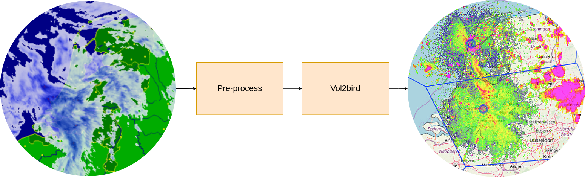

# RAVL: Easy processing of weather radar data to vertical profiles of biological scatterers.

The airspace is becoming increasingly crowded. High-rises, wind farms and airports all contribute to 
conflict with aerial organisms. Information about the movements of organisms in the air is required to identify stop-over sites, 
migratory routes, and patterns. This can inform mitigation of conflicts by, for example, wind-turbine curtailments or 
early warning systems for aviation. Weather radars, that continuously monitor the sky across continents, 
can be used to study movements of birds, bats, and insects. However, for continental scale analysis, large volumes of 
data are required to be processed and analyzed, which often rely on institute-specific tools and computational resources. 
This severely hampers collaborative efforts because of the initial investment of time and resources 
to gain access to existing computing infrastructure. The Radar Aeroecology Virtual Lab (RAVL) 
facilitates collaboration and re-use of infrastructure and tools.

### Tutorial
A tutorial is available in [NaaVRE](https://beta.naavre.net/vreapp/vl/ravl) in [Virtual Labs/RAVL/Git public/virtual_lab/documentation](./virtual_lab/documentation/RAVL_tutorial.ipynb).  

### Conceptual description
This virtual lab (VL) allows users to easily obtain biological scatters from radar data.
The lab reduces the initial investment of acquiring access and expertise to computational resources and provide immediate access to tools built by domain experts. These tools are then run in the cloud leveraging the performance and flexibility of cloud computing.
The VL is shipped with the data management plan used by the University of Amsterdam's Animal Movement Ecology group (UvA IBED-TCE AME) to provide an out of the box solution for managing large datasets. 
RAVL is currently capable of accessing, processing, managing and visualizing data from the The Royal Netherlands Meteorological Institute's (RNMI) open Radar Data repository. The VL has multi-language support, and has well known libraries such as bioRad in R and xradar in Python installed.  Furthermore, it uses vol2bird for processing biological echoes found in Polar Volume files to Vertical Profiles.

### Keywords 
  - Aerial animal movement
  - Biological scatter
  - Bird migration
  - Radar ontology
  - Weather radar
  - Altitude profile

### Features
- Vol2bird algorithm
- Mapping to Vol2bird input format
- Easy KNMI data retrieval

### Related virtual labs
https://beta.naavre.net/vreapp/vl/quadfavl

### Publication(s)
Dokter AM, Liechti F, Stark H, Delobbe L, Tabary P, Holleman I, J. R. Soc.  
**Bird migration flight altitudes studied by a network of operational weather radars**  
Interface, 8, 30–43, 2011, [DOI 10.1098/rsif.2010.0116](https://doi.org/10.1098/rsif.2010.0116)

### Related projects
This virtual lab uses the vol2bird algorithm, which can be found on [github](https://github.com/adokter/vol2bird).

### Possible applications
- Select a date range to create a vertical profiles of biological scatters.
- Write your own pre-processor to map weather radar data from sources other than KNMI to a format readable by vol2bird.

### Recommended prior knowledge
Picking custom dates to study biological scatters using KNMI weather radar data is possible by only setting parameters.  
Preprocessing other weather radar data to the vol2bird input format requires some experience in handling APIs and data in Python.

### Documentation
See [the documentation page](/docs/Virtual%20lab%20documentation/RAVL/documentation). Additionally, a user guide and tutorial is available in [the virtual lab](https://staging.demo.naavre.net/vreapp/vlabs/RAVL).

### Point of contact
Berend-Christiaan Wijers  
IBED - University of Amsterdam   
Email: B.C.Wijers@uva.nl